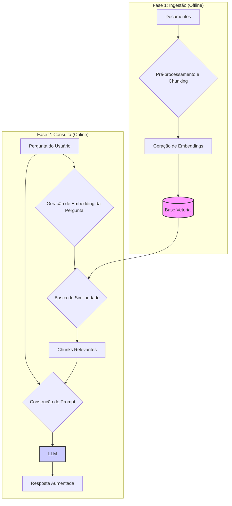

# Capítulo 05 — RAG Básico: Integrando Todos os Componentes

Chegamos ao momento em que todos os conceitos se conectam. Nos capítulos anteriores, aprendemos sobre LLMs, embeddings, bases vetoriais e pré-processamento. Agora vamos ver como esses componentes trabalham juntos para formar um **sistema RAG (Retrieval-Augmented Generation) completo e funcional**.

Neste capítulo, construiremos um RAG do zero, entenderemos cada etapa do pipeline e implementaremos melhorias práticas baseadas no código do nosso projeto.

**Resumo:** neste capítulo implementamos um sistema RAG completo, integrando recuperação, geração e controle de qualidade, com exemplos práticos usando o projeto.

**Sumário:**
1. Anatomia de um sistema RAG
2. Pipeline de ingestão (offline)
3. Pipeline de consulta (online)
4. Implementação básica passo a passo
5. Melhorando a qualidade das respostas
6. Tratamento de erros e edge cases
7. Monitoramento e debugging
8. Otimizações de performance
9. Conclusão

---

## 1. Anatomia de um sistema RAG

Um sistema RAG tem duas fases principais:

### 1.1. Fase de ingestão (offline)
```
Documentos → Pré-processamento → Chunking → Embeddings → Base Vetorial
```

### 1.2. Fase de consulta (online)
```
Pergunta → Embedding → Busca Vetorial → Chunks Relevantes → Prompt + LLM → Resposta
```

### Diagrama do Fluxo RAG

Abaixo, um diagrama que ilustra as duas fases principais do RAG:



### 1.3. Componentes essenciais

- **Document Loader:** carrega diferentes tipos de arquivo
- **Text Splitter:** divide documentos em chunks
- **Embedding Model:** transforma texto em vetores
- **Vector Store:** armazena e busca embeddings
- **Retriever:** encontra chunks relevantes
- **LLM:** gera respostas baseadas no contexto
- **Prompt Template:** estrutura as instruções para o LLM

---

## KB vs RAG: o que são e quando usar cada um
Muitas plataformas já oferecem soluções de "knowledge base" (KB) gerenciadas que incluem capacidades de RAG "embutidas" (ou grounding). É importante distinguir conceitos e escolher a estratégia certa:

- KB (Knowledge Base) gerenciada: um serviço que armazena e gerencia seu conteúdo (documentos, embeddings, metadados) e normalmente oferece APIs de busca/retrieval e integração direta com modelos. Exemplos: AWS Bedrock Knowledge Bases, Vertex AI RAG Engine, Azure AI "On your data" / AI Foundry.
- RAG (Retrieval-Augmented Generation): é um padrão/arquitetura que combina recuperação (retrieval) de evidências com geração por LLM; pode ser implementado com serviços gerenciados ou com uma stack própria (LangChain, LlamaIndex, Chroma/FAISS, etc.).

Por que a distinção importa:
- Usar um KB gerenciado acelera a entrega e reduz trabalho operacional — bom para prototipagem e para projetos que querem escalar sem reinventar a infraestrutura.
- Implementar um RAG próprio dá controle fino sobre chunking, reranking, caching, custo e privacidade — bom quando você precisa de ajuste fino ou integração complexa.

Recomendação prática
- Comece com um serviço gerenciado (Bedrock KB, Vertex RAG Engine, Azure On-Your-Data) para validar a ideia rapidamente.
- Se precisar de controle (ex.: pipelines de chunking customizados, reranker, estratégias de cache, otimização de custo), migre para uma stack própria com LangChain/LlamaIndex + sua base vetorial.

Fluxos úteis e casos de uso
- Para conteúdos longos (um tutorial/obra longa com >20 páginas), organize por coleção/obra e por capítulo/versão. Use metadados (capítulo, seção, assunto) para filtros precisos.
- Para relações complexas entre entidades (personagens, tópicos interligados), avalie abordagens como GraphRAG (recuperação baseada em grafos/entidades) em vez de apenas similaridade de embeddings.

---

## 2. Pipeline de ingestão (offline)

### 2.1. Carregamento de documentos

```python
from langchain_community.document_loaders import DirectoryLoader, TextLoader
from langchain.text_splitter import RecursiveCharacterTextSplitter
from langchain_ollama import OllamaEmbeddings
from langchain_chroma import Chroma

def load_documents(data_dir="data"):
    """Carrega todos os documentos do diretório"""
    loader = DirectoryLoader(
        data_dir, 
        glob="**/*.{txt,md}",
        loader_cls=TextLoader,
        loader_kwargs={"encoding": "utf-8"}
    )
    
    documents = loader.load()
    print(f"Carregados {len(documents)} documentos")
    return documents
```

### 2.2. Chunking inteligente

```python
def create_chunks(documents, chunk_size=1000, chunk_overlap=200):
    """Divide documentos em chunks otimizados"""
    text_splitter = RecursiveCharacterTextSplitter(
        chunk_size=chunk_size,
        chunk_overlap=chunk_overlap,
        separators=["\n\n", "\n", ". ", " ", ""]
    )
    
    chunks = text_splitter.split_documents(documents)
    
    # Adiciona metadados úteis
    for i, chunk in enumerate(chunks):
        chunk.metadata.update({
            "chunk_id": f"chunk_{i}",
            "chunk_size": len(chunk.page_content),
            "processed_at": datetime.now().isoformat()
        })
    
    print(f"Criados {len(chunks)} chunks")
    return chunks
```

### 2.3. Geração de embeddings e indexação

```python
def create_vectorstore(chunks, collection_name="rag-demo"):
    """Cria base vetorial com os chunks"""
    embeddings = OllamaEmbeddings(model="nomic-embed-text")
    
    vectorstore = Chroma.from_documents(
        documents=chunks,
        embedding=embeddings,
        collection_name=collection_name,
        persist_directory="db"
    )
    
    print(f"Base vetorial criada com {len(chunks)} chunks")
    return vectorstore
```

### 2.4. Pipeline completo de ingestão

```python
def ingest_documents(data_dir="data"):
    """Pipeline completo de ingestão"""
    print("=== Iniciando ingestão ===")
    
    # 1. Carregar documentos
    documents = load_documents(data_dir)
    if not documents:
        print("Nenhum documento encontrado!")
        return None
    
    # 2. Criar chunks
    chunks = create_chunks(documents)
    
    # 3. Filtrar chunks de baixa qualidade
    chunks = filter_quality_chunks(chunks)
    
    # 4. Criar base vetorial
    vectorstore = create_vectorstore(chunks)
    
    print("=== Ingestão concluída ===")
    return vectorstore

def filter_quality_chunks(chunks, min_length=50):
    """Remove chunks de baixa qualidade"""
    quality_chunks = []
    
    for chunk in chunks:
        content = chunk.page_content.strip()
        
        # Remove chunks muito pequenos
        if len(content) < min_length:
            continue
            
        # Remove chunks que são só espaços ou símbolos
        if not any(c.isalnum() for c in content):
            continue
            
        quality_chunks.append(chunk)
    
    print(f"Filtrados: {len(chunks)} → {len(quality_chunks)} chunks")
    return quality_chunks
```

---

## 3. Pipeline de consulta (online)

### 3.1. Configuração do retriever

```python
def setup_retriever(collection_name="rag-demo", k=3):
    """Configura o retriever para busca vetorial"""
    embeddings = OllamaEmbeddings(model="nomic-embed-text")
    
    vectorstore = Chroma(
        collection_name=collection_name,
        embedding_function=embeddings,
        persist_directory="db"
    )
    
    # Configura retriever com parâmetros otimizados
    retriever = vectorstore.as_retriever(
        search_type="similarity",
        search_kwargs={"k": k}
    )
    
    return retriever
```

### 3.2. Template de prompt

```python
from langchain.prompts import PromptTemplate

PROMPT_TEMPLATE = """
Você é um assistente especializado que responde perguntas baseado exclusivamente no contexto fornecido.

CONTEXTO:
{context}

PERGUNTA: {question}

INSTRUÇÕES:
- Responda APENAS com base no contexto fornecido
- Se a informação não estiver no contexto, diga "Não encontrei essa informação no contexto fornecido"
- Seja preciso e objetivo
- Cite a fonte quando possível

RESPOSTA:
"""

def create_prompt_template():
    """Cria template de prompt otimizado para RAG"""
    return PromptTemplate(
        template=PROMPT_TEMPLATE,
        input_variables=["context", "question"]
    )
```

### 3.3. Configuração do LLM

```python
from langchain_ollama import ChatOllama

def setup_llm(model="llama3", temperature=0.1):
    """Configura LLM com parâmetros otimizados para RAG"""
    return ChatOllama(
        model=model,
        temperature=temperature,  # Baixa criatividade para mais consistência
        num_ctx=4096,            # Contexto suficiente para chunks
        top_k=10,                # Limita vocabulário para mais precisão
        top_p=0.9
    )
```

### 3.4. Pipeline de consulta

```python
def query_rag(question, retriever, llm, prompt_template):
    """Pipeline completo de consulta RAG"""
    print(f"Pergunta: {question}")
    
    # 1. Recuperar chunks relevantes
    print("🔍 Buscando chunks relevantes...")
    relevant_chunks = retriever.get_relevant_documents(question)
    
    if not relevant_chunks:
        return "Não encontrei informações relevantes para sua pergunta."
    
    # 2. Preparar contexto
    context = "\n\n".join([
        f"Fonte: {chunk.metadata.get('source', 'desconhecida')}\n{chunk.page_content}"
        for chunk in relevant_chunks
    ])
    
    print(f"📄 Encontrados {len(relevant_chunks)} chunks relevantes")
    
    # 3. Gerar prompt
    prompt = prompt_template.format(context=context, question=question)
    
    # 4. Consultar LLM
    print("🤖 Gerando resposta...")
    response = llm.invoke(prompt)
    
    return {
        "answer": response.content,
        "sources": [chunk.metadata.get('source') for chunk in relevant_chunks],
        "chunks_used": len(relevant_chunks)
    }
```

---

## 4. Implementação básica passo a passo

### 4.1. Script completo de RAG básico

```python
#!/usr/bin/env python3
"""
RAG Básico - Implementação completa
"""

import os
from datetime import datetime
from langchain_community.document_loaders import DirectoryLoader, TextLoader
from langchain.text_splitter import RecursiveCharacterTextSplitter
from langchain_ollama import OllamaEmbeddings, ChatOllama
from langchain_chroma import Chroma
from langchain.prompts import PromptTemplate

class SimpleRAG:
    def __init__(self, data_dir="data", db_dir="db"):
        self.data_dir = data_dir
        self.db_dir = db_dir
        self.embeddings = OllamaEmbeddings(model="nomic-embed-text")
        self.llm = ChatOllama(model="llama3", temperature=0.1)
        self.vectorstore = None
        self.retriever = None
        
    def ingest(self):
        """Ingestão completa de documentos"""
        print("=== Iniciando ingestão ===")
        
        # Carrega documentos
        loader = DirectoryLoader(self.data_dir, glob="**/*.{txt,md}", loader_cls=TextLoader)
        documents = loader.load()
        print(f"📁 Carregados: {len(documents)} documentos")
        
        # Cria chunks
        splitter = RecursiveCharacterTextSplitter(chunk_size=1000, chunk_overlap=200)
        chunks = splitter.split_documents(documents)
        print(f"✂️  Chunks criados: {len(chunks)}")
        
        # Cria vectorstore
        self.vectorstore = Chroma.from_documents(
            documents=chunks,
            embedding=self.embeddings,
            persist_directory=self.db_dir
        )
        print(f"💾 Base vetorial atualizada")
        
    def setup_retriever(self, k=3):
        """Configura retriever"""
        if not self.vectorstore:
            self.vectorstore = Chroma(
                embedding_function=self.embeddings,
                persist_directory=self.db_dir
            )
        
        self.retriever = self.vectorstore.as_retriever(search_kwargs={"k": k})
        
    def query(self, question):
        """Consulta o sistema RAG"""
        if not self.retriever:
            self.setup_retriever()
            
        # Busca chunks
        chunks = self.retriever.get_relevant_documents(question)
        
        if not chunks:
            return "Não encontrei informações relevantes."
        
        # Prepara contexto
        context = "\n\n".join([chunk.page_content for chunk in chunks])
        
        # Prompt
        prompt = f"""
Baseado no contexto abaixo, responda a pergunta de forma precisa:

CONTEXTO:
{context}

PERGUNTA: {question}

RESPOSTA:
"""
        
        # Gera resposta
        response = self.llm.invoke(prompt)
        return response.content

# Exemplo de uso
if __name__ == "__main__":
    rag = SimpleRAG()
    
    # Ingestão (rode uma vez)
    rag.ingest()
    
    # Consultas
    questions = [
        "O que é paralelismo?",
        "Como configurar cache?",
        "Explique sobre embeddings"
    ]
    
    for question in questions:
        print(f"\n❓ {question}")
        answer = rag.query(question)
        print(f"💬 {answer}")
```

### 4.2. Testando o sistema

```bash
# 1. Adicione documentos em data/
echo "Paralelismo é a execução simultânea de tarefas para melhorar performance." > data/paralelismo.txt
echo "Cache é um mecanismo de armazenamento temporário para acelerar acesso a dados." > data/cache.txt

# 2. Execute o RAG
python simple_rag.py
```

---

## 5. Melhorando a qualidade das respostas

### 5.1. Reranking de resultados

```python
def rerank_chunks(chunks, question, top_k=3):
    """Reordena chunks por relevância usando scoring adicional"""
    scored_chunks = []
    
    for chunk in chunks:
        # Score baseado em palavras-chave
        keyword_score = calculate_keyword_overlap(chunk.page_content, question)
        
        # Score baseado em tamanho (chunks muito pequenos ou grandes são penalizados)
        length_score = calculate_length_score(chunk.page_content)
        
        # Score combinado
        total_score = keyword_score * 0.7 + length_score * 0.3
        
        scored_chunks.append((chunk, total_score))
    
    # Ordena por score e retorna top_k
    scored_chunks.sort(key=lambda x: x[1], reverse=True)
    return [chunk for chunk, score in scored_chunks[:top_k]]
```

### 5.2. Validação de resposta

```python
def validate_response(response, chunks):
    """Valida se a resposta está baseada no contexto"""
    response_lower = response.lower()
    
    # Verifica se há evidência do contexto na resposta
    context_evidence = any(
        word in response_lower 
        for chunk in chunks 
        for word in chunk.page_content.lower().split()
        if len(word) > 4
    )
    
    # Verifica se não é uma resposta genérica
    generic_phrases = [
        "não sei", "não posso ajudar", "não tenho informação",
        "preciso de mais contexto"
    ]
    
    is_generic = any(phrase in response_lower for phrase in generic_phrases)
    
    return {
        "has_context_evidence": context_evidence,
        "is_generic": is_generic,
        "quality_score": 1.0 if context_evidence and not is_generic else 0.5
    }
```

### 5.3. Fallback para respostas inadequadas

```python
def query_with_fallback(question, retriever, llm, max_attempts=2):
    """Consulta com fallback em caso de resposta inadequada"""
    
    for attempt in range(max_attempts):
        # Busca com diferentes parâmetros
        k = 3 + attempt  # Aumenta chunks em tentativas subsequentes
        chunks = retriever.get_relevant_documents(question, k=k)
        
        if not chunks:
            continue
            
        # Gera resposta
        response = generate_response(question, chunks, llm)
        
        # Valida qualidade
        validation = validate_response(response, chunks)
        
        if validation["quality_score"] > 0.7:
            return response
    
    return "Não consegui encontrar uma resposta adequada para sua pergunta com base nos documentos disponíveis."
```

---

## 6. Tratamento de erros e edge cases

### 6.1. Verificação de dependências

```python
def check_system_health():
    """Verifica se todos os componentes estão funcionando"""
    issues = []
    
    # Verifica Ollama
    try:
        embeddings = OllamaEmbeddings(model="nomic-embed-text")
        embeddings.embed_query("teste")
    except Exception as e:
        issues.append(f"Ollama/Embeddings: {e}")
    
    # Verifica base vetorial
    if not os.path.exists("db"):
        issues.append("Base vetorial não encontrada. Execute ingestão primeiro.")
    
    # Verifica documentos
    if not os.path.exists("data") or not os.listdir("data"):
        issues.append("Diretório 'data' vazio. Adicione documentos.")
    
    return issues
```

### 6.2. Tratamento de consultas vazias

```python
def validate_question(question):
    """Valida se a pergunta é adequada"""
    if not question or not question.strip():
        return False, "Pergunta não pode estar vazia"
    
    if len(question.strip()) < 5:
        return False, "Pergunta muito curta"
    
    # Verifica se não é só números ou símbolos
    if not any(c.isalpha() for c in question):
        return False, "Pergunta deve conter texto"
    
    return True, "OK"
```

---

## 7. Monitoramento e debugging

### 7.1. Logging detalhado

```python
import logging

def setup_logging():
    """Configura logging para debugging"""
    logging.basicConfig(
        level=logging.INFO,
        format='%(asctime)s - %(levelname)s - %(message)s',
        handlers=[
            logging.FileHandler('rag.log'),
            logging.StreamHandler()
        ]
    )

def log_query_details(question, chunks, response):
    """Log detalhado de cada consulta"""
    logging.info(f"Query: {question}")
    logging.info(f"Chunks found: {len(chunks)}")
    logging.info(f"Sources: {[c.metadata.get('source') for c in chunks]}")
    logging.info(f"Response length: {len(response)}")
```

### 7.2. Métricas de performance

```python
import time

class RAGMetrics:
    def __init__(self):
        self.queries = []
    
    def log_query(self, question, retrieval_time, generation_time, chunks_count):
        """Registra métricas de uma consulta"""
        self.queries.append({
            "question": question,
            "retrieval_time": retrieval_time,
            "generation_time": generation_time,
            "total_time": retrieval_time + generation_time,
            "chunks_count": chunks_count,
            "timestamp": time.time()
        })
    
    def get_stats(self):
        """Retorna estatísticas de performance"""
        if not self.queries:
            return {}
        
        total_times = [q["total_time"] for q in self.queries]
        return {
            "total_queries": len(self.queries),
            "avg_response_time": sum(total_times) / len(total_times),
            "avg_chunks_per_query": sum(q["chunks_count"] for q in self.queries) / len(self.queries)
        }
```

---

## 8. Otimizações de performance

### 8.1. Cache de embeddings

```python
from functools import lru_cache

@lru_cache(maxsize=100)
def cached_embed_query(text):
    """Cache embeddings de consultas frequentes"""
    embeddings = OllamaEmbeddings(model="nomic-embed-text")
    return embeddings.embed_query(text)
```

### 8.2. Batch processing para ingestão

```python
def batch_ingest(documents, batch_size=10):
    """Processa documentos em lotes para otimizar memória"""
    chunks = []
    
    for i in range(0, len(documents), batch_size):
        batch = documents[i:i + batch_size]
        batch_chunks = create_chunks(batch)
        chunks.extend(batch_chunks)
        
        print(f"Processado lote {i//batch_size + 1}/{(len(documents)-1)//batch_size + 1}")
    
    return chunks
```

---

## 9. Conclusão

Implementamos um sistema RAG completo que integra:

- **Ingestão robusta:** carregamento, chunking e indexação otimizados
- **Consulta inteligente:** busca vetorial + geração contextual
- **Qualidade controlada:** validação, reranking e fallbacks
- **Monitoramento:** logs, métricas e debugging
- **Performance:** cache e otimizações

Nosso RAG básico já é funcional e pode ser usado em produção para casos simples. No próximo capítulo, vamos adicionar guardrails e controles avançados para torná-lo ainda mais robusto e confiável.

**Exercício prático:** implemente o `SimpleRAG` com seus próprios documentos, teste diferentes tamanhos de chunk e compare a qualidade das respostas.

---

### Pergunta ao leitor

Agora que temos um RAG básico funcionando, quer que eu escreva o **Capítulo 06 — Guardrails e Controle de Qualidade** para adicionar validações e controles avançados ao sistema?
