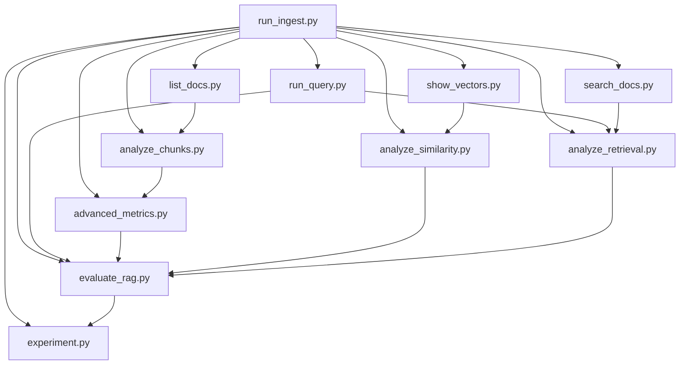

# 📚 Índice Completo da Documentação RAG Demo

> **Sistema Educacional Estruturado para Aprendizagem de RAG**
> 
> Este índice organiza toda a documentação por níveis de complexidade e objetivos de aprendizagem, facilitando uma progressão natural no entendimento do sistema RAG.

---

## 🎯 **VISÃO GERAL DO SISTEMA**

### 🏗️ **CORE PACKAGE (rag_demo/)**
> **Módulos fundamentais do sistema RAG com documentação educacional completa**

- **[`__init__.py`](rag_demo/__init__.py)** - 🔧 Arquitetura de pacote e padrões de design
- **[`config.py`](rag_demo/config.py)** - ⚙️ Configuração baseada em ambiente e twelve-factor app
- **[`ingest.py`](rag_demo/ingest.py)** - 📥 Pipeline de ingestão com fundamentos matemáticos
- **[`rag.py`](rag_demo/rag.py)** - 🤖 Arquitetura RAG completa (retrieval + generation)
- **[`utils.py`](rag_demo/utils.py)** - 🛠️ Funções utilitárias e manipulação de documentos

### 📖 Documentação Principal
- **[README.md](../../README.md)** - Introdução geral e setup inicial
- **[TUTORIAL_RAG.md](../guides/TUTORIAL_RAG.md)** - Guia completo sobre conceitos RAG

### 🎓 Sistema Educacional
- **[RESUMO_SISTEMA_EDUCACIONAL.md](RESUMO_SISTEMA_EDUCACIONAL.md)** - Visão geral do sistema educacional
- **[GLOSSARIO_CONCEITOS.md](../reference/GLOSSARIO_CONCEITOS.md)** - Dicionário de termos técnicos

### 🗺️ Navegação e Organização
- **[GUIA_NAVEGACAO.md](../guides/GUIA_NAVEGACAO.md)** - Fluxos de navegação detalhados
- **[CLASSIFICACAO_SCRIPTS.md](CLASSIFICACAO_SCRIPTS.md)** - Níveis de complexidade dos scripts
- **[MAPA_VISUAL.md](MAPA_VISUAL.md)** - Representação visual das interconexões

---

## 📊 **ORGANIZAÇÃO POR NÍVEIS DE COMPLEXIDADE**

### 🟢 **NÍVEL BÁSICO** - Fundamentos e Primeiros Passos
> **Objetivo:** Compreender conceitos básicos e executar operações fundamentais

#### Scripts Básicos
| Script | Descrição | Conceitos Aprendidos |
|--------|-----------|---------------------|
| **[run_ingest.py](scripts/run_ingest.py)** | Pipeline de ingestão de dados | Chunking, Embeddings, Persistência |
| **[run_query.py](scripts/run_query.py)** | Interface de consulta | Query Processing, Retrieval, Generation |
| **[list_docs.py](scripts/list_docs.py)** | Listagem de documentos | Metadados, Indexação, Organização |
| **[search_docs.py](scripts/search_docs.py)** | Busca semântica | Similaridade, Ranking, Filtragem |

#### Documentação de Apoio
- **[EXEMPLOS_USO_SCRIPTS.md](../guides/EXEMPLOS_USO_SCRIPTS.md)** - Exemplos práticos de uso

---

### 🟡 **NÍVEL INTERMEDIÁRIO** - Análise e Compreensão
> **Objetivo:** Analisar o comportamento do sistema e compreender métricas

#### Scripts Intermediários
| Script | Descrição | Conceitos Avançados |
|--------|-----------|-------------------|
| **[analyze_chunks.py](scripts/analyze_chunks.py)** | Análise de fragmentação | Distribuição, Sobreposição, Otimização |
| **[show_vectors.py](scripts/show_vectors.py)** | Visualização de embeddings | Dimensionalidade, Clustering, PCA |
| **[list_raw.py](scripts/list_raw.py)** | Análise de dados brutos | Preprocessamento, Qualidade, Estrutura |

---

### 🔴 **NÍVEL AVANÇADO** - Pesquisa e Experimentação
> **Objetivo:** Conduzir pesquisa científica e otimização avançada

#### Scripts Avançados
| Script | Descrição | Metodologia Científica |
|--------|-----------|----------------------|
| **[advanced_metrics.py](scripts/advanced_metrics.py)** | Métricas matemáticas avançadas | Estatística, Normalização, Entropia |
| **[analyze_similarity.py](scripts/analyze_similarity.py)** | Análise de similaridade | Clustering, Visualização, Detecção |
| **[analyze_retrieval.py](scripts/analyze_retrieval.py)** | Análise de recuperação | Precision, Recall, NDCG |
| **[evaluate_rag.py](scripts/evaluate_rag.py)** | Avaliação científica completa | Benchmarking, Validação, Métricas |
| **[experiment.py](scripts/experiment.py)** | Framework experimental | A/B Testing, Otimização, Reprodutibilidade |

#### Documentação Avançada
- **[DOCUMENTACAO_SCRIPTS_AVANCADOS.md](../reference/DOCUMENTACAO_SCRIPTS_AVANCADOS.md)** - Detalhes técnicos avançados

---

## 🔄 **FLUXO DE APRENDIZAGEM RECOMENDADO**

### 📚 **Fase 1: Fundamentação Teórica** (30-60 min)
1. **[README.md](../../README.md)** - Setup e visão geral
2. **[TUTORIAL_RAG.md](../guides/TUTORIAL_RAG.md)** - Conceitos fundamentais
3. **[GLOSSARIO_CONCEITOS.md](../reference/GLOSSARIO_CONCEITOS.md)** - Vocabulário técnico

### 🛠️ **Fase 2: Prática Básica** (1-2 horas)
1. **[run_ingest.py](scripts/run_ingest.py)** - Primeira ingestão de dados
2. **[run_query.py](scripts/run_query.py)** - Primeiras consultas
3. **[list_docs.py](scripts/list_docs.py)** - Exploração do índice
4. **[search_docs.py](scripts/search_docs.py)** - Busca semântica

### 🔍 **Fase 3: Análise Intermediária** (2-3 horas)
1. **[analyze_chunks.py](scripts/analyze_chunks.py)** - Compreender fragmentação
2. **[show_vectors.py](scripts/show_vectors.py)** - Visualizar embeddings
3. **[list_raw.py](scripts/list_raw.py)** - Analisar dados de entrada

### 🧪 **Fase 4: Pesquisa Avançada** (4-8 horas)
1. **[advanced_metrics.py](scripts/advanced_metrics.py)** - Métricas científicas
2. **[analyze_similarity.py](scripts/analyze_similarity.py)** - Análise de similaridade
3. **[analyze_retrieval.py](scripts/analyze_retrieval.py)** - Avaliação de recuperação
4. **[evaluate_rag.py](scripts/evaluate_rag.py)** - Avaliação completa
5. **[experiment.py](scripts/experiment.py)** - Experimentação científica

---

## 🎯 **OBJETIVOS DE APRENDIZAGEM POR NÍVEL**

### 🟢 **Nível Básico - Competências Fundamentais**
- [ ] Compreender o que é RAG e como funciona
- [ ] Executar ingestão de documentos
- [ ] Realizar consultas básicas
- [ ] Explorar documentos indexados
- [ ] Fazer buscas semânticas simples

### 🟡 **Nível Intermediário - Análise e Compreensão**
- [ ] Analisar qualidade da fragmentação
- [ ] Interpretar visualizações de embeddings
- [ ] Compreender métricas de qualidade
- [ ] Otimizar parâmetros básicos
- [ ] Diagnosticar problemas comuns

### 🔴 **Nível Avançado - Pesquisa e Inovação**
- [ ] Conduzir avaliações científicas rigorosas
- [ ] Implementar experimentos controlados
- [ ] Aplicar estatística para validação
- [ ] Otimizar hiperparâmetros sistematicamente
- [ ] Contribuir para pesquisa em RAG

---

## 📋 **MATRIZ DE INTERDEPENDÊNCIAS**

### Scripts que Dependem de Outros

### Ordem Recomendada de Execução
1. **[run_ingest.py](scripts/run_ingest.py)** ← *Sempre primeiro (cria o índice)*
2. **[run_query.py](scripts/run_query.py)** ← *Testa funcionamento básico*
3. **[list_docs.py](scripts/list_docs.py)** ← *Explora o que foi indexado*
4. **Demais scripts conforme objetivo de aprendizagem**

---

## 🔗 **NAVEGAÇÃO RÁPIDA**

### Por Tipo de Atividade
- **📊 Análise de Dados:** [analyze_chunks.py](scripts/analyze_chunks.py) • [list_raw.py](scripts/list_raw.py) • [show_vectors.py](scripts/show_vectors.py)
- **🔍 Busca e Recuperação:** [search_docs.py](scripts/search_docs.py) • [analyze_retrieval.py](scripts/analyze_retrieval.py)
- **📈 Métricas e Avaliação:** [advanced_metrics.py](scripts/advanced_metrics.py) • [evaluate_rag.py](scripts/evaluate_rag.py)
- **🧪 Experimentação:** [analyze_similarity.py](scripts/analyze_similarity.py) • [experiment.py](scripts/experiment.py)

### Por Objetivo de Pesquisa
- **Otimização de Chunking:** [analyze_chunks.py](scripts/analyze_chunks.py) → [experiment.py](scripts/experiment.py)
- **Qualidade de Embeddings:** [show_vectors.py](scripts/show_vectors.py) → [analyze_similarity.py](scripts/analyze_similarity.py)
- **Performance de Retrieval:** [analyze_retrieval.py](scripts/analyze_retrieval.py) → [evaluate_rag.py](scripts/evaluate_rag.py)
- **Validação Científica:** [advanced_metrics.py](scripts/advanced_metrics.py) → [evaluate_rag.py](scripts/evaluate_rag.py)

---

## 📞 **SUPORTE E RECURSOS ADICIONAIS**

### Documentação de Referência
- **[GLOSSARIO_CONCEITOS.md](../reference/GLOSSARIO_CONCEITOS.md)** - Para termos técnicos
- **[EXEMPLOS_USO_SCRIPTS.md](EXEMPLOS_USO_SCRIPTS.md)** - Para exemplos práticos
- **[DOCUMENTACAO_SCRIPTS_AVANCADOS.md](DOCUMENTACAO_SCRIPTS_AVANCADOS.md)** - Para detalhes técnicos

### Recursos Externos
- **LangChain Documentation:** https://docs.langchain.com/
- **ChromaDB Documentation:** https://docs.trychroma.com/
- **Ollama Documentation:** https://ollama.ai/docs

---

*📝 **Nota:** Esta documentação é um sistema vivo. À medida que novos scripts são adicionados ou funcionalidades são expandidas, este índice será atualizado para manter a organização e facilitar a navegação.*
